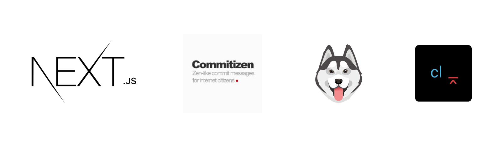

<h1 align="center">
  
</h1>

<div align="center">

<!-- Badges -->


</div>

---

<div align="center">
  <a href="#dart-about">:dart:&nbsp;&nbsp;About</a> &nbsp; | &nbsp; 
  <a href="#rocket-technologies">:rocket:&nbsp;&nbsp;Technologies</a> &nbsp; | &nbsp;
  <a href="#white_check_mark-requeriments">:white_check_mark:&nbsp;&nbsp;Requeriments</a> &nbsp; | &nbsp;
  <a href="#checkered_flag-starting">:checkered_flag::&nbsp;&nbsp;Starting</a>
</div>

<br>

## :dart: Sobre ##

The project is a template [NextJS](https://nextjs.org/) from standardization with [Commitlint](https://commitlint.js.org/#/), [Husky](https://typicode.github.io/husky/#/) and [Commitizen](https://commitizen-tools.github.io/commitizen/).

## :rocket: Technologies ##

This project was developed with the following technologies:

- [Next.js](https://nextjs.org/)
- [Commitizen](https://commitizen-tools.github.io/commitizen/)
- [Commitlint](https://commitlint.js.org/#/)
- [Husky](https://typicode.github.io/husky/#/)

## :white_check_mark: Requirements ##

- [Git](https://git-scm.com/)
- [Node](https://nodejs.org/en/)
- [Yarn](https://yarnpkg.com/lang/en/)

## :checkered_flag: Starting ##

```bash
# Clone this project
$ git clone git@github.com:KaiqueCovo/template-nextjs-commitlint-husky-commitizen.git

# Go into the repository
$ cd template-nextjs-commitlint-husky-commitizen

# Install dependencies
$ yarn install

# Run the commitizen
$ yarn commit
```

---
Made with ♥  by [Kaique Covo](https://www.linkedin.com/in/kaique-covo-a46331147/) :wave: